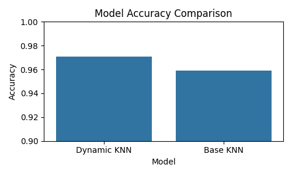
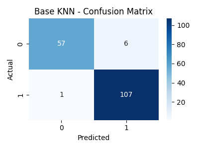

# 🔍 Algorytm KNN z dynamiczną liczbą sąsiadów

This project was created as part of a university course and is documented in Polish.

Projekt wykonany w ramach zajęć uczelnianych.

Projekt przedstawia implementację zmodyfikowanego algorytmu KNN (K-Nearest Neighbors), który adaptacyjnie dobiera liczbę sąsiadów (`k`) na podstawie rozrzutu (spread) odległości. Dzięki temu model lepiej radzi sobie w obszarach o zróżnicowanej gęstości danych.

## ⚙️ Opis działania
Dynamiczny algorytm działa według następującego schematu:

1. Oblicz odległości (Manhattan) do punktów treningowych.
2. Sortuj odległości rosnąco.
3. Dodawaj sąsiadów do listy, dopóki ich rozrzut nie przekroczy progu `max_spread`.
4. Klasyfikuj na podstawie aktualnej listy.

Dla porównania zaimplementowano klasyczny KNN z ustaloną liczbą `k = 5`.

## 📊 Eksperyment

### 🔢 Dane:
- Zbiór: `load_breast_cancer()` z `sklearn.datasets`
- Próbki: 569
- Atrybuty: 30 cech (właściwości guzów)
- Klasy: Nowotwór łagodny / złośliwy (0/1)

### 🧪 Metody oceny:
- Dokładność (accuracy)
- Macierz pomyłek (confusion matrix)
- Wizualizacja wyników

## 🖼️ Wyniki

### 📌 Porównanie dokładności


### 📌 Macierz pomyłek – klasyczny KNN


### 📌 Macierz pomyłek – dynamiczny KNN


## 🧠 Wnioski

- Dynamiczne dostosowanie liczby sąsiadów redukuje wpływ punktów odstających.
- Model elastycznie reaguje na lokalną gęstość danych.
- W testach uzyskano nieco lepszą dokładność niż w klasycznym KNN.
- Możliwość regulacji `max_spread` pozwala łatwo dostosować model do nowych danych.

## 💡 Uruchamianie

```bash
python dynamic_knn.py
```
